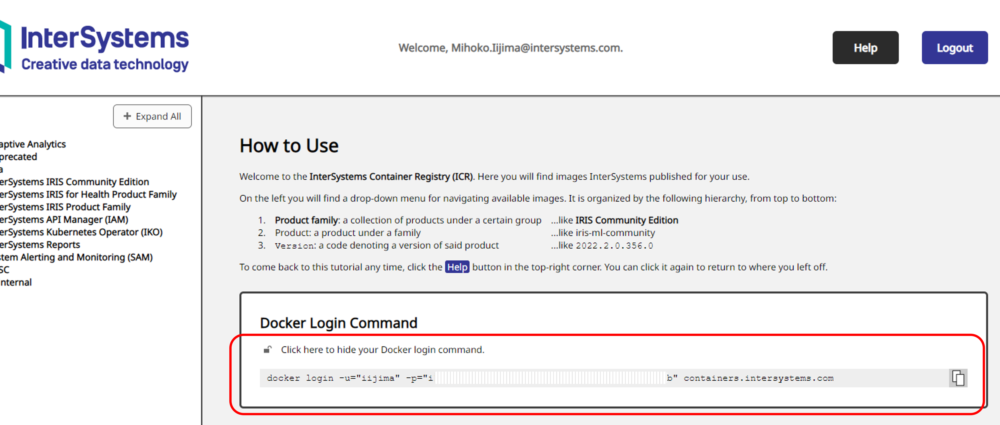
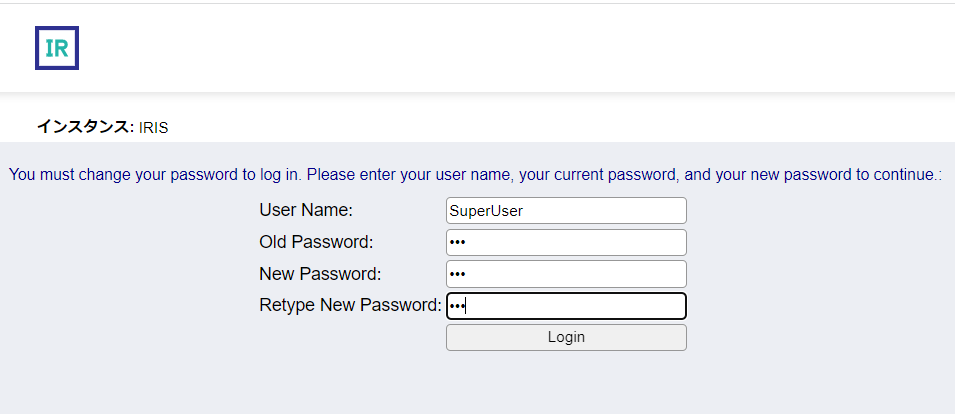
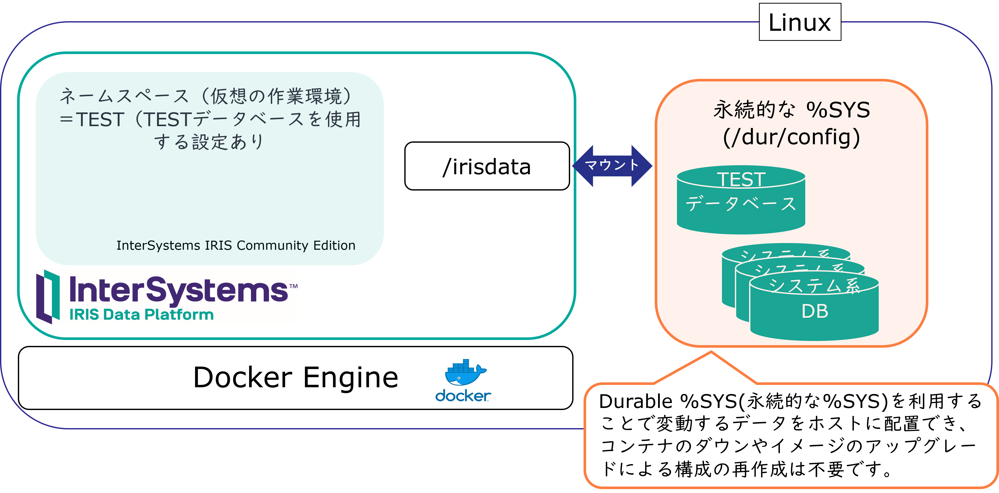

# dockerコンテナ内で動くInterSystems IRIS（コンテナ版IRIS）コミュニティエディションの使い方

以下の内容をご説明します。

1. [コミュニティエディションのコンテナ版IRISの入手方法](#1-コミュニティエディションのコンテナ版irisの入手方法)
2. [コンテナ版IRIS使用方法](#2-コンテナ版iris使用方法)
3. [永続的な%SYS（Durable %SYS）の使い方](#3-永続的なsysdurable-sysの使い方)
4. [アップグレード手順](#4アップグレード手順)
5. [PythonスクリプトファイルをIRISから実行する（Embedded Pythonの利用）](#5pythonスクリプトファイルをirisから実行するembedded-pythonの利用)

> InterSystems製品がサポートするコンテナ・イメージについて詳しくは、ドキュメントの [コンテナ・プラットフォーム](https://docs.intersystems.com/irisforhealthlatest/csp/docbookj/Doc.View.cls?KEY=ISP_technologies#ISP_platforms_container) をご参照ください。
___

## 1. コミュニティエディションのコンテナ版IRISの入手方法

[InterSystemsのコンテナレジストリ](https://containers.intersystems.com/contents)より入手できます。

> ご参考：[InterSystemsコンテナレジストリ Webユーザインターフェースのお知らせ](https://jp.community.intersystems.com/node/533171)

お手元の環境から docker pullを行う前に、[InterSystemsのコンテナレジストリ](https://containers.intersystems.com/contents)にログインを行う必要があります。

docker login 情報は、[InterSystemsのコンテナレジストリ](https://containers.intersystems.com/contents)にログインを行っていただくと下図のように表示されます。

> ログインアカウントは開発者コミュニティのアカウントと共通です。アカウントの作成は[こちらから](https://login.intersystems.com/login/SSO.UI.Register.cls?referrer=https%3A//jp.community.intersystems.com/)行えます。



`docker pull` を行う環境で上記画面に表示される `docker login` 情報をコピーし実行します。

例）
```
docker login -u="iijima" -p="ixxxxxxxxxxxxxx"  containers.intersystems.com
```

`Login Succeeded` と表示されたらログイン成功です。

## 2. コンテナ版IRIS使用方法

必要なイメージを[InterSystemsのコンテナレジストリ](https://containers.intersystems.com/contents)からpullした後は、`docker run` や `docker-compose.yml` を利用してコンテナを開始できます。

ホストからコンテナ版IRISにアクセスする場合、以下のポート番号をホスト上の任意番号に割り当ててご利用ください。

コンテナ内ポート番号|役割|
--|--|
1972|IRISのスーパーサーバポート<br>ODBC、JDBC、.NET、Native APIを利用する場合に指定するポート番号です。|
52773|Webサーバポート（管理ポータルを表示するときに使用しているポート番号）<br>管理ポータル表示用にApacheを使用しています。<br><b>※簡易的にインストールされたApacheであるため、REST/SOAP、WebアプリケーションのWebサーバーとして利用できません。</b>|

1. コンテナ開始方法

    a) `docker run`を使う場合のコマンド例

    - コンテナ名を `iris` とし、ホスト側のスーパーサーバポートを`9091`、Webサーバポートを`9092`に割り当てる
        ```
        docker run --name iris -d --publish 9091:1972 --publish 9092:52773 containers.intersystems.com/intersystems/irishealth-community:2022.1.2.574.0
        ```

    - コンテナ名を `iris` とし、コンテナのタイムゾーンを日本時間に設定（`-e TZ=JST-9`）、ホスト側のスーパーサーバポートを`9091`、Webサーバポートを`9092`に割り当て、ホストの `./pysrcディレクトリ` をコンテナの `/pysrcディレクトリ` にボリュームマウントする

        >事前にホスト上の `./pysrcディレクトリ`の権限を所有者以外からアクセスできるように（コンテナ内から利用できるように）変更しています。

        ```
        docker run --name iris -d -e TZ=JST-9 --publish 9091:1972 --publish 9092:52773 --volume ./pysrc:/pysrc containers.intersystems.com/intersystems/irishealth-community:2022.1.2.574.0
        ```

    - コンテナ名を `iris` とし、コンテナのタイムゾーンを日本時間に設定（`-e TZ=JST-9`）、ホスト側のスーパーサーバポートを`9091`、Webサーバポートを`9092`に割り当て、ホストの `./pysrcディレクトリ` をコンテナの `/pysrcディレクトリ` にボリュームマウントする。CPUの割り当て数を指定して（`--cpuset-cpus 0`）コンテナを開始する。

        >事前にホスト上の `./pysrcディレクトリ`の権限を所有者以外からアクセスできるように（コンテナ内から利用できるように）変更しています。
        ```
        docker run --name iris -d -e TZ=JST-9 --publish 9091:1972 --publish 9092:52773 --volume ./pysrc:/pysrc --cpuset-cpus 0 containers.intersystems.com/intersystems/irishealth-community:2022.1.2.574.0
        ```

    b) `docker-compose.yml`を使う場合

    ※ a) で書いた内容のymlは以下の通りです。

    >事前にホスト上の `./pysrcディレクトリ`の権限を所有者以外からアクセスできるように（コンテナ内から利用できるように）変更しています。

    ```
    version: '3.7'

    services:
    iristest:
        image: containers.intersystems.com/intersystems/irishealth-community:2022.1.2.574.0
        ports: ["9094:1972","9095:52773"]
        container_name: iris
        volumes: ["./pysrc:/pysrc"]
        environment: 
        - TZ=JST-9

    ```
    **注意：`docker-compose.yml`では、CPUの割り当て数を指定できません。**

    コンテナ開始は以下の通りです。

    ```
    docker-compose up -d
    ```

2. コンテナへのログイン
    
    `-it` の引数にコンテナ名（例ではiris）を指定します

    ```
    docker exec -it iris bash
    ```

    - コンテナ内IRISへのログイン

        ```
        iris session iris
        ```
        
        実行例：IRISのUSERネームスペースにログインします。
        ```
        irisowner@723230df80fa:~$ iris session iris

        Node: 723230df80fa, Instance: IRIS

        USER>
        ```

    - コンテナ内IRISからログアウト
    
        `halt` コマンドを使用します。

        コマンド実行例）
        ```
        USER>halt
        irisowner@723230df80fa:~$
        ```

3. コンテナからのログアウト

    `exit` コマンドを使用します。

4. 管理ポータルへのアクセス

    ※ログイン初回のみ、パスワードの変更画面が表示されます。（ユーザごとに初回ログイン時パスワード変更画面が表示されます）

    例） localhost:Webサーバポート/csp/sys/UtilHome.csp

    http://localhost:9092/csp/sys/UtilHome.csp

    事前定義ユーザ（SuperUser、_SYSTEM など）の**初期パスワードは SYS** で登録されています。

    初回アクセス時に変更画面が表示されるので任意のパスワードに変更してください（パスワードは3文字以上の英数字記号を指定できます）。

    

5. コンテナ停止

    - `docker run`で開始した場合

        docker stop コンテナ名

        ```
        docker stop iris
        ```
    - `docker-compose.yml`を使用した場合

        ```
        docker-compose stop
        ```

6. コンテナ破棄

    **注意：コンテナで作成したデータベース、コード類などすべて削除されます**

    - `docker run`で開始した場合

        docker rm コンテナ名

        ```
        docker rm iris
        ```
    - `docker-compose.yml`を使用した場合

        ```
        docker-compose down
        ```
    
    コンテナを破棄すると中で使用していたデータベースやその他ファイルもすべて破棄されます。

    IRISで作成したデータベースの中身をコンテナ破棄の影響を受けずに永続化する方法として、[永続的な%SYS(Durable %SYS)](https://docs.intersystems.com/irisforhealthlatest/csp/docbookj/DocBook.UI.Page.cls?KEY=ADOCK#ADOCK_iris_durable)という利用方法があります。
    
    使用例については、[永続的な%SYS（Durable %SYS）の使い方](#3-永続的なsysdurable-sysの使い方)をご覧ください。

## 3. 永続的な%SYS（Durable %SYS）の使い方

[永続的な%SYS(Durable %SYS)](https://docs.intersystems.com/irisforhealthlatest/csp/docbookj/DocBook.UI.Page.cls?KEY=ADOCK#ADOCK_iris_durable)を利用するために設定するコンテナ上ディレクトリには、IRISのインストールディレクリ以下にある構成ファイル（iris.cpf）やシステムデータベースが含まれます。ユーザ用DB（例ではTEST）も配置できるので、コンテナのダウンやIRISイメージのアップグレードによる構成の再作成を防ぐことができます。

> 含まれる内容について詳細は[永続的な %SYS ディレクトリの内容](https://docs.intersystems.com/irisforhealthlatest/csp/docbookj/DocBook.UI.Page.cls?KEY=ADOCK#ADOCK_iris_durable_contents)をご参照ください。



「永続的な%SYS」を使用するため以下の指定を行います。

- ホスト上に専用のディレクトリを用意し、コンテナ内ディレクトリとのボリュームマウントを行う

- ホスト上のディレクトリの権限を所有者以外からもアクセスできるように変更する（例 [setup.sh](/setup.sh)）

- ボリュームマウントを行ったコンテナ内ディレクトリを専用パラメータ：`ISC_DATA_DIRECTORY` に指定する


具体的な指定例は以下の通りです。


1. `docker run` を利用する場合

    ボリュームマウントの指定を追加します。以下例では、ホスト上の `./irisdata` をコンテナ上の `/dur` にマウントしています。
    ```
    --volume ./irisdata:/dur
    ```
    ホスト上のディレクトリ（`irisdata`）の権限を所有者以外からもアクセスできるように変更する
    
    例）
    ```
    chmod 777 irisdata
    ```

    専用パラメータ：`ISC_DATA_DIRECTORY` にコンテナ上のディレクトリを指定します。

    例では、ホスト上の `./irisdata` をコンテナ上の `/dur` にマウントしています。永続的な%SYSの専用ディレクトリとして `/dur/config` を設定しています。
    ```
    ISC_DATA_DIRECTORY=/dur/config
    ```

    全体のコマンド例は以下の通りです。
    
    >コンテナ名を `iris` とし、コンテナのタイムゾーンを日本時間に設定（`-e TZ=JST-9`）、ホスト側のスーパーサーバポートを`9091`、Webサーバポートを`9092`に割り当て、ホストの `./pysrcディレクトリ` をコンテナの `/pysrcディレクトリ` にボリュームマウントする。ホスト上の `./irisdata` をコンテナ上の `/dur` にマウントし、永続的な%SYSの専用ディレクトリとして `/dur/config`を指定。CPUの割り当て数を指定して（`--cpuset-cpus 0`）コンテナを開始する。

    ```
    docker run --name iris -d --cpuset-cpus 0 -e TZ=JST-9 --publish 9091:1972 --publish 9092:52773 --volume ./irisdata:/dur --volume ./pysrc:/pysrc --env ISC_DATA_DIRECTORY=/dur/config intersystems/irishealth-community:2022.1.2.574.0
    ```

2. `docker-compose.yml`を使用する場合
    
    ※ 1. で書いた内容のymlは以下の通りです。

    例） [docker-compose.yml](docker-compose.yml)

    ```
    version: '3.7'

    services:
    iristest:
        image: containers.intersystems.com/intersystems/irishealth-community:2022.1.2.574.0
        ports: ["9094:1972","9095:52773"]
        container_name: iris
        volumes: ["./pysrc:/pysrc","./irisdata:/dur"]
        environment: 
        - TZ=JST-9
        - ISC_DATA_DIRECTORY=/dur/config
    ```
    **注意：`docker-compose.yml`では、CPUの割り当て数を指定できません。**
    
## 4.アップグレード手順

※この説明の中では、InterSystems IRIS for Health Community Ediction のバージョン2022.1.2.574.0 から 2023.1.0.196.0 にアップグレードする例でご説明します。

**※ダウングレードは行えません。ご注意ください。**

アップグレード前に用意した内容は以下の通りです。
- TESTネームスペース／データベース
- 新規ユーザ（testusr）
- TESTネームスペースで[Sample.Personクラス](/src/Sample/Person.cls)を作成
- TESTネームスペースで[Sample.Personクラス](/src/Sample/Person.cls)（テーブル）のデータを1件作成

`iris session iris -U TEST`で作成したTESTネームスペースにログインしています。

その後 `write $ZV`で使用中バージョンを確認しています。（2022.1.2であることを確認できます）

```
irisowner@4b889a4cb5fb:~$ iris session iris -U TEST

Node: 4b889a4cb5fb, Instance: IRIS

TEST>write $ZV
IRIS for UNIX (Ubuntu Server LTS for x86-64 Containers) 2022.1.2 (Build 574U) Fri Jan 13 2023 15:24:04 EST
TEST>set p=##class(Sample.Person).%New()

TEST>set p.Name="山田太郎"

TEST>set p.Email="taro@mail.com"

TEST>set st=p.%Save()

TEST>write st
1
TEST>

TEST>:sql
SQL Command Line Shell
----------------------------------------------------

The command prefix is currently set to: <<nothing>>.
Enter <command>, 'q' to quit, '?' for help.
[SQL]TEST>>select * from Sample.Person
1.      select * from Sample.Person

ID      Email   Name
1       taro@mail.com   山田太郎

1 Rows(s) Affected
statement prepare time(s)/globals/cmds/disk: 0.0623s/42,165/275,476/1ms
          execute time(s)/globals/cmds/disk: 0.0001s/2/683/0ms
                          cached query class: %sqlcq.TEST.cls6
---------------------------------------------------------------------------
[SQL]TEST>>quit

TEST>halt
irisowner@4b889a4cb5fb:~$ 
```


この後の手順は以下の通りです。

（例では、`docker run`で立ち上げたコンテナの手順でご紹介します）

1. コンテナを停止する。

    ```
    sudo docker stop iris
    ```

2. コンテナを破棄する。

    ```
    sudo docker rm iris
    ```

3. 新しいバージョンのイメージに変更してコンテナを開始する

    ```
    docker run --name iris -d --cpuset-cpus 0 -e TZ=JST-9 --publish 9091:1972 --publish 9092:52773 --volume ./irisdata:/dur --volume ./pysrc:/pysrc --env ISC_DATA_DIRECTORY=/dur/config intersystems/irishealth-community:2023.1.0.196.0
    ```
4. アップグレード前に作成した内容がそのまま引き継げているか確認

    ※ `write $ZV`の出力結果を見ると新しいバージョンに変わっていることがわかります。

    ```
    irisowner@df1cd15d3220:~$ iris session iris -U TEST

    Node: df1cd15d3220, Instance: IRIS

    TEST>write $ZV
    IRIS for UNIX (Ubuntu Server LTS for x86-64 Containers) 2023.1 (Build 196U) Tue Feb 14 2023 00:47:27 EST
    TEST>set p=##class(Sample.Person).%OpenId(1)

    TEST>zwrite p
    p=1@Sample.Person  ; <OREF>
    +----------------- general information ---------------
    |      oref value: 1
    |      class name: Sample.Person
    |           %%OID: $lb("1","Sample.Person")
    | reference count: 2
    +----------------- attribute values ------------------
    |       %Concurrency = 1  <Set>
    |              Email = "taro@mail.com"
    |               Name = "山田太郎"
    +-----------------------------------------------------

    TEST>:sql
    SQL Command Line Shell
    ----------------------------------------------------

    The command prefix is currently set to: <<nothing>>.
    Enter <command>, 'q' to quit, '?' for help.
    [SQL]TEST>>select * from Sample.Person
    1.      select * from Sample.Person

    ID      Email   Name
    1       taro@mail.com   山田太郎

    1 Rows(s) Affected
    statement prepare time(s)/globals/cmds/disk: 0.0418s/38,331/173,563/1ms
            execute time(s)/globals/cmds/disk: 0.0002s/2/670/0ms
                            cached query class: %sqlcq.TEST.cls1
    ---------------------------------------------------------------------------
    [SQL]TEST>>quit

    TEST>halt
    irisowner@df1cd15d3220:~$
    ```

    ※ testusrユーザも管理ポータルから確認できれば完了です。
___
＜参考情報＞
- [動画：Dockerコンテナ版 InterSystems IRIS data platform の勧め](https://jp.community.intersystems.com/node/493661)

___

## 5.PythonスクリプトファイルをIRISから実行する（Embedded Pythonの利用）

ボリュームマウントしたディレクトリ[pysrc](pysrc) にPythonスクリプトファイル（[SimpleSample.py](/SimpleSample.py)）を配置し、コンテナ内のIRISからEmbedded Pythonで実行する例をご紹介します。

1. [SimpleSample.py](/SimpleSample.py)を[pysrc](pysrc)にコピーします。
2. IRISにログインし、以下実行します。

    例では、TESTネームスペースで実行していますがどのネームスペースでも実行できます。

    `do ##class(%SYS.Python).Shell()`を実行し、Pythonシェルに切り替えています。

    ```
    TEST>do ##class(%SYS.Python).Shell()

    Python 3.10.6 (main, Nov 14 2022, 16:10:14) [GCC 11.3.0] on linux
    Type quit() or Ctrl-D to exit this shell.
    >>> import sys
    >>> sys.path+=['/pysrc']
    >>> import SimpleSample
    >>> SimpleSample.test()
    こんにちは！
    2023-03-08 17:25:23.186844
    >>> quit()

    TEST>halt
    irisowner@9d017e9d3d9e:~$
    ```

    [pysrc](pysrc)にコピーしたスクリプトファイルを実行したいので、`sysモジュール`をインポートし、`sys.path`にスクリプトファイルのディレクトリを追加しています。

    その後は、一般的なPythonの実行方法と同一です。

    ***

    以下の方法は、Pythonシェルではなく、IRISのObjectScriptから実行する方法です。

    Pythonシェルと同様に、`sysモジュール`を利用してスクリプトファイルがあるディレクトリを`sys.path`に指定したいので、sysモジュールをインポートし、変数にsysモジュールを操作するインスタンスをセットします。

    ```
    set sys=##class(%SYS.Python).Import("sys")
    do sys.path.append("/pysrc")
    ```

    Pythonスクリプトファイルをインポートし、変数に操作用インスタンスをセットします。
    ```
    set simple=##class(%SYS.Python).Import("SimpleSample")

    ```
    Pythonスクリプト内の関数を実行します。
    ```
    do simple.test()
    ```

    実行の流れは以下の通りです。
    ```
    USER>set sys=##class(%SYS.Python).Import("sys")

    USER>do sys.path.append("/pysrc")

    USER>w

    sys=<OBJECT REFERENCE>[1@%SYS.Python]
    USER>

    USER>set test=##class(%SYS.Python).Import("SimpleSample")

    USER>set simple=##class(%SYS.Python).Import("SimpleSample")

    USER>do simple.test()
    こんにちは！
    2023-03-08 17:32:58.607850

    USER>
    ```
